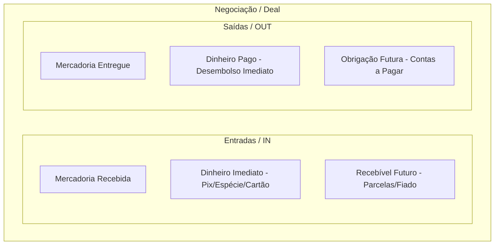

# 00. Glossário e Conceito Universal de Negociação

## 1. Filosofia Central do Domínio

O sistema é construído sobre o princípio de que o usuário (vendedor, revendedor autônomo, lojista de veículos, eletrônicos ou peças) **não opera um ERP tradicional**. Ele realiza negociações no mundo real, muitas vezes dinâmicas, compostas por múltiplos ativos, pagamentos fragmentados, trocas e prazos informais.

> **Princípio:** O usuário fala como pensa. O sistema traduz a linguagem das ruas para transações determinísticas e auditáveis.

---

## 2. Dicionário de Vocabulário das Ruas vs. Domínio do Sistema

| Termo do Usuário / Gíria de Mercado | Conceito no Sistema | Definição Operacional |
| :--- | :--- | :--- |
| **"Na rua"** | Recebíveis em aberto (*Receivables / Open Balance*) | Saldo total que terceiros devem ao usuário, englobando parcelas futuras a vencer e parcelas vencidas. |
| **"Atrasado"** / **"Vencido"** | Inadimplência (*Overdue Receivables*) | Recebíveis com data de vencimento anterior à data atual e status pendente. |
| **"Em mercadoria"** | Capital em estoque (*Inventory at Cost*) | Soma dos custos diretos de aquisição e agregados (preparação, peças, despachante) de todos os itens disponíveis para venda. |
| **"Volta"** | Diferencial financeiro em permutas (*Trade Cash Balance*) | Valor monetário pago ou recebido como complemento de valor na troca entre produtos de preços distintos. |
| **"Volta parcelada"** | Recebível originado de permuta (*Trade Installments*) | Saldo da troca que foi dividido em compromissos futuros. |
| **"Abatimento"** | Amortização não-financeira (*Non-cash Debt Adjustment*) | Quitação parcial ou total de débito através da entrega de um serviço, peça, favores ou desconto concedido, sem trânsito de dinheiro em espécie/Pix. |
| **"Fiado" / "No papel"** | Crédito direto sem promissória formalizada | Compromisso de pagamento com prazo flexível ou indefinido. |
| **"Promissória"** | Título de crédito vinculado a parcelas | Recebível formalizado com datas fixas de vencimento e numeração de via. |
| **"Pegar de volta"** / **"Devolução"** | Desfazimento com estorno de estoque (*Return / Rollback*) | Retorno da mercadoria ao inventário do vendedor e cancelamento/estorno dos recebíveis pendentes. |
| **"Limpar a conta" / "Quitar"** | Liquidação total (*Full Settlement*) | Pagamento do valor residual total de um cliente ou negociação específica. |

---

## 3. O Paradigma do Movimento Universal de Negociação (MUN)

Toda operação comercial (venda direta, compra, troca com volta, fiado, quitação) é modelada como uma **Negociação (`Deal`)** composta por **Movimentos Direcionais**:

### 3.1 Fluxos de Entrada (`IN`)
1. **Mercadoria (`Item IN`)**: Item que entra na posse do usuário (ex: compra direta ou recebido como parte de pagamento na troca). Gera novo registro de estoque avaliado pelo valor acordado.
2. **Dinheiro Imediato (`Cash IN`)**: Montante liquidado no ato (Pix, dinheiro em espécie, TED, cartão de débito/crédito à vista). Alimenta o fluxo de caixa diário.
3. **Direito Futuro (`Receivable IN`)**: Saldo a receber de terceiros (parcelamento formal, fiado, promissória). Cria parcelas e alimenta o saldo "Na rua".

### 3.2 Fluxos de Saída (`OUT`)
1. **Mercadoria (`Item OUT`)**: Item que sai do estoque do usuário. Baixa o item no inventário e aciona o cálculo de CMV para apuração de lucro.
2. **Dinheiro Imediato (`Cash OUT`)**: Montante desembolsado no ato (pagamento de compra, volta paga em dinheiro, custos de transporte/reforma).
3. **Obrigação Futura (`Payable OUT`)**: Saldo a pagar para terceiros (volta da troca parcelada a pagar, compra de mercadoria a prazo).

---

## 4. Equação de Balanço da Negociação

Para qualquer negociação ser válida, o valor econômico negociado deve ser estritamente coerente:

$$\text{Valor Total Negociado} = \sum \text{Entradas Imediatas} + \sum \text{Valores a Receber} + \sum \text{Valor Avaliado dos Itens IN}$$

O backend valida deterministicamente essa equação. A Inteligência Artificial extrai os dados, mas **a integridade matemática é garantida por código determinístico**.
