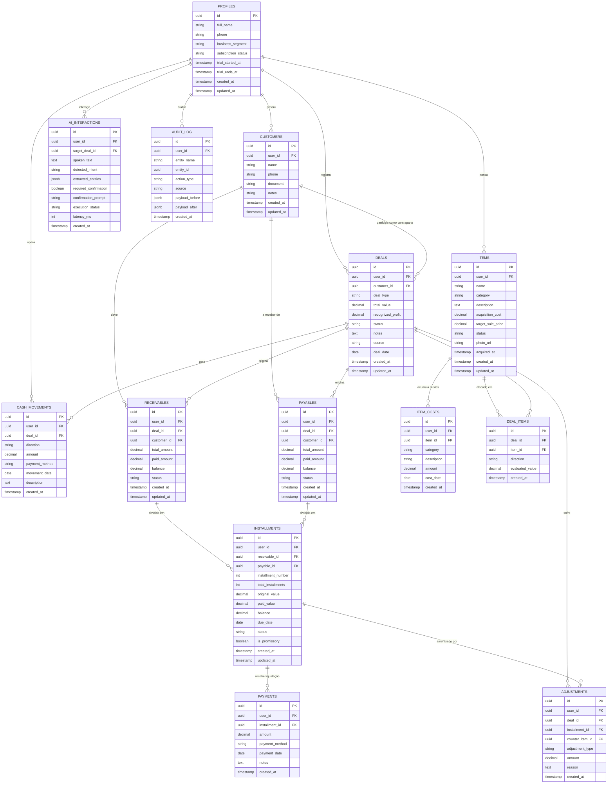
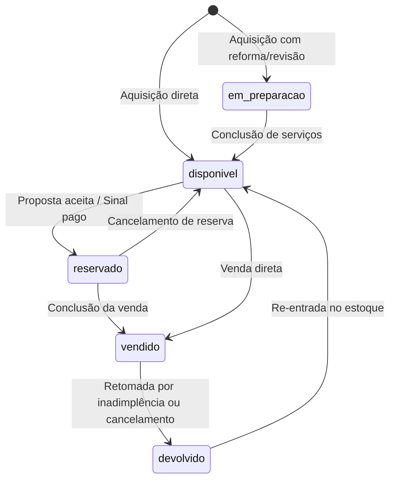
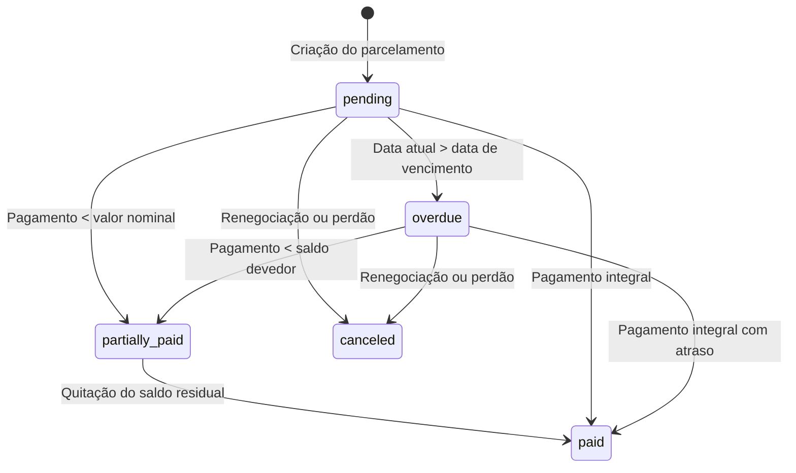
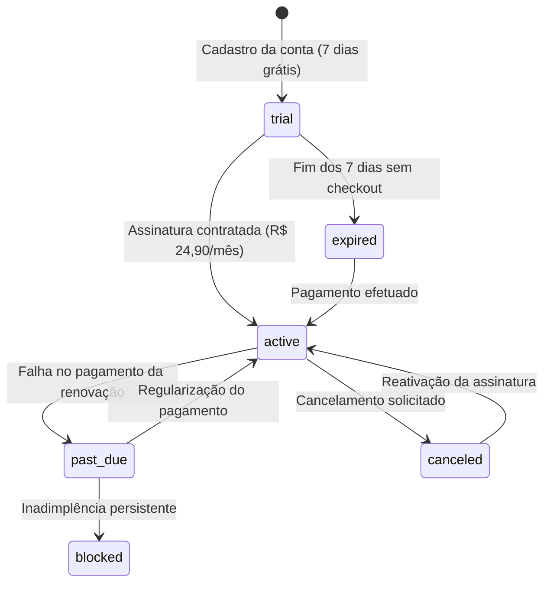

# Modelagem do Domínio: Diagrama Entidade-Relacionamento e Dicionário de Dados

## 1. Visão Geral da Arquitetura de Dados

O modelo de dados do SaaS Voice-First é concebido para ser estritamente **multi-tenant**, onde cada entidade de negócio pertence a um único usuário autenticado (`user_id`).

A integridade referencial, constraints e triggers no PostgreSQL garantem que cálculos financeiros, baixas de estoque e conciliação de parcelas sejam consistentes independentemente do canal de entrada (voz via LLM ou formulário manual).

---

## 2. Diagrama Entidade-Relacionamento (ERD)

---

## 3. Máquinas de Estados (State Machines)

### 3.1 Ciclo de Vida da Mercadoria (`items.status`)

### 3.2 Ciclo de Vida da Parcela (`installments.status`)

### 3.3 Ciclo de Vida da Assinatura (`profiles.subscription_status`)

---

## 4. Dicionário de Constraints e Regras de Integridade

1. **Multi-tenant Obrigatório:** Toda tabela (exceto `profiles` cujo `id` é a chave primária de usuário) possui coluna `user_id uuid NOT NULL REFERENCES profiles(id) ON DELETE CASCADE`.
2. **Direções Estritas:**
   - `deal_items.direction` aceita exclusivamente `'IN'` (mercadoria recebida) ou `'OUT'` (mercadoria entregue).
   - `cash_movements.direction` aceita exclusivamente `'IN'` (entrada de numerário) ou `'OUT'` (saída/desembolso).
3. **Valores Positivos:**
   - `CHECK (amount >= 0)` em todas as tabelas financeiras.
   - `CHECK (total_value >= 0)` em `deals`.
   - `CHECK (balance >= 0)` em `installments`, `receivables` e `payables`.
4. **Equação do Saldo da Parcela:**
   - `balance = original_value - paid_value`. Quando `balance = 0`, `status` obrigatoriamente torna-se `'paid'`.
